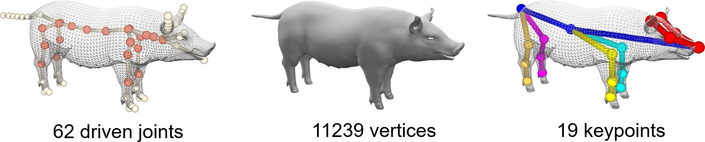
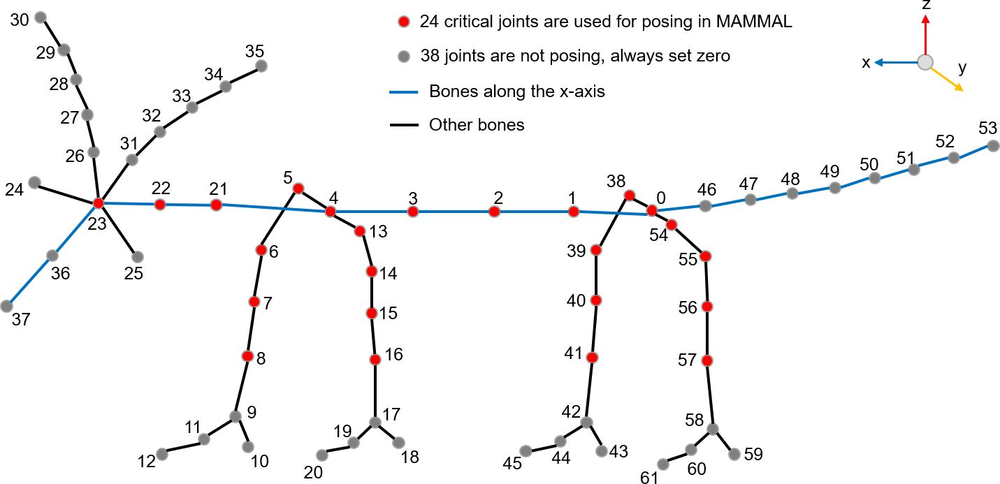
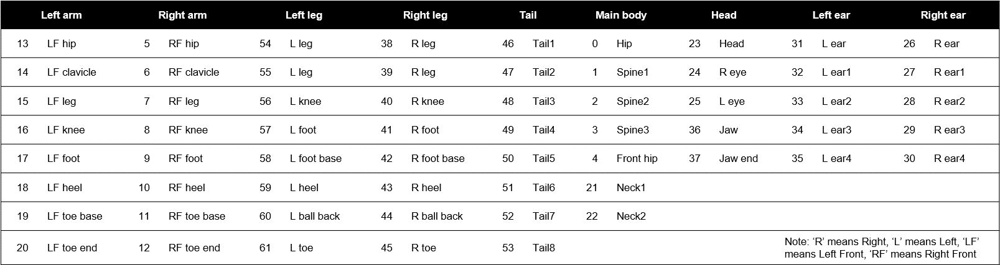

# PIG model
This repository contains key files and description of the PIG model proposed in the paper. 

Currently, this model only contains a fix shape, i.e. there is no shape blend shape parameter or pose blend shape parameter. 

</img>

# Contents 
## core_txt_files folder 
This folder contains txt files which are the core of the PIG model. 

`vertices.txt`: 11239 * 3 float matrix, T-pose (or rest pose) position of all the vertices. 

`t_pose_joints.txt`: 62 * 3 float matrix, T-pose (or rest pose) position of 62 embeded joints. The joint order, topology and names are shown in the figures. 

</img>

</img>

`skinning_weights.txt`: 38841 rows. Each row has three number: `j v w`. `j` is the index of joint. `v` is the index of vertex, `w` is a float value representing the skinning weight connecting joint `j` and vertex `v`. Actually, the full skinning weights can be represented as a 62 * 11239 matrix, whose non-zero values are list in the 38841 number pairs. 

`J_regressor.txt`: 8079 rows, same structure to `skinning_weights.txt`. Differently, J_regressor is used to obtain joint positions given vertices, which is useful when we need to obtain the updated t-pose joints after deforming the t-pose vertices.  

`parents.txt`: 62 integer number indicating the joint tree topology. The i-th number indicates the parent joint id of i-th joint. If `-1`, means it is the root joint. 

`textures.txt`: 12208 * 2 float matrix. It is the texture coordinates. It is more than vertex number because some vertices correspond to two tex coordinates. They are mapped thourgh surface triangle faces. 

`faces_vert.txt`: 22446 * 3 integer matrix. Means the surface triangles. Each number is vertex index (start from 0). 

`faces_tex.txt`: 22446 * 3 integer matrix. Also the surface triangles, yet each number is texture index (start from 0). The face order is the same to `faces_ver.txt`. 

## full_txt_files folder 
This folder contains several additional files showing some other useful features of the PIG model. It also contains two `.obj` files showing the PIG model (`PIG.obj`) and a coarse PIG model (`PIG_reduced.obj`). These `.obj` files can be opened with [MeshLab](https://www.meshlab.net/), Maya, Blender or other graphics softwares. 

`body_parts.txt`: 11239 integer numbers indicating which high-level body part a vertex belongs to. The body part order is defined in `body_part_defs.txt`. We defined 12 body parts, indexed from 1, so we set the 0 body part with name `NOT_BODY`. 

`reduced_ids.txt`: 546 integer numbers mapping the full 11239 vertices to a coarse mesh vertices. This coarse PIG model is useful for accelerating distance computing between two posed meshes. 

`reduced_faces.txt`: 1088 * 3 integer matrix. Faces for the coarse PIG model. 

`sym.txt`: 11239 integer numbers. The i-th number indicate that vertex index which is symmetric to i-th vertex with respect to the x-axis. 

## pkl_files folder 
`PIG_core.pkl` contains the dict of PIG parameters same to `core_txt_files`.

`PIG_full.pkl` contains the dict of PIG parameters same to `full_txt_files`. 

# Dependencies
To run the code here, the following packages should be installed: `numpy`, `scipy`. 